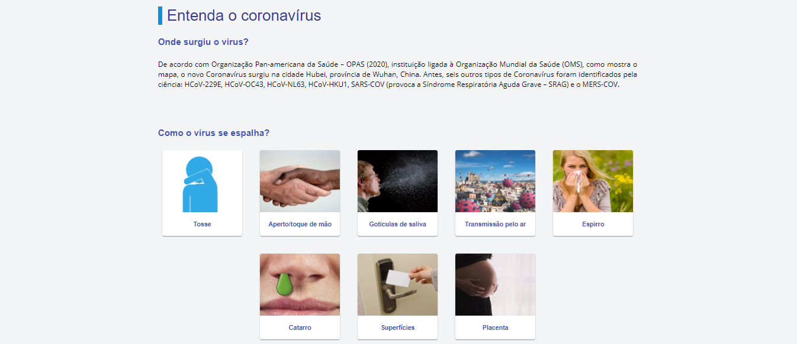

## Covid-19

O projeto apresenta uma plataforma com informações sobre o avanço da Covid-19 no estado da Paraíba. 

### Parceiros

A implementação foi feita por [Lucas](https://github.com/lucasmatheus1), [Rafael](https://github.com/rafaelfigueredog) e [Marcelo](https://github.com/M4RCELO).

O site está hospedado no domínio da [UFCG](https://portal.ufcg.edu.br/).

[URL do site](https://covid19.cct.ufcg.edu.br/#/)
